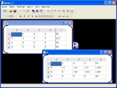

# Matice 2
  
Program Matice 2 slouží k provádění výpočtů s maticemi. V jednoduchém víceokenním (tzv. MDI) rozhraní
lze pracovat s více maticemi zároveň.

Lze provádět například tyto operace:
* Transponování
* Inverzní matice
* Sčítání
* Odčítání
* Násobení
* Převedení na trojúhelníkovou (Gaussova eliminace)
* Násobení konstantou
* Výpočet opačné, jednotkové a diagonální matice
* Výpočet determinantu a hodnosti matice
* atd...

## Rozhraní
Aplikace má intuitivní uživatelské rozhraní. Jednoduše lze vytvářet nové matice, přidávat nové řádky a sloupce, případně je také odebírat nebo přesouvat.
Matice se může pojmenovat a uložit do souboru. Program ukládá jak do nativního formátu MT2, tak do formátu CSV. Dále je tu také možnost exportu do sešitu aplikace Excel (soubor .XLS).

## Speciální vlastnosti

* M2 umí pracovat s komplexními čísly. Komplexní čísla se zadávají jednoduše ve formátu například 5-i2, i, -i2, 2+i5 apod... Písmeno imaginární proměnné si lze zvolit.
* M2 zvládá **přesnou práci se zlomky**. Pokud je to možné, program nezaokrouhluje, ale počítá **přímo se zlomky** a výsledek je tak **velice přesný**. Zlomky se zadávají ve tvaru například 1/2, 8/3, 1+1/2,-2-2/3 apod.

## Screenshoty
Pár obrázku z aplikace si můžete prohlédnout [zde](screenshoty)

## Stažení
Spustitelný soubor pro Windows lze stahnout zde: [nejnovější release](https://github.com/jindrapetrik/matice/releases/latest)
Tamtéž naleznete možnost stažení zdrojového kódu.

## Historie změn
Historii změn se uchovává v souboru [CHANGELOG.md](https://github.com/jindrapetrik/matice/blob/main/CHANGELOG.md)